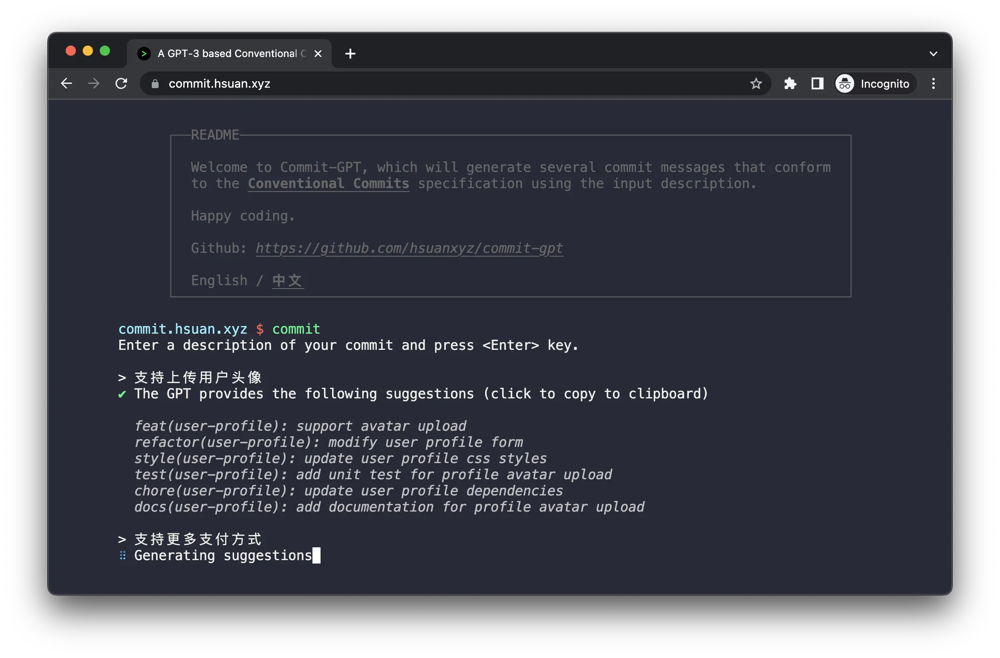

# Conventional Commits Generator

A GPT-3-based tool that uses the input prompts to generate several commit messages that conform to the [Conventional Commits](https://www.conventionalcommits.org) specifications.

<p align="center">
    
</p>

### Online use

[A GPT-3 based Conventional Commits Generator](http://commit.hsuan.xyz/)

### One-Click Deploy

[](https://vercel.com/new/clone?repository-url=https://github.com/hsuanxyz/commit-gpt/tree/main&project-name=commit-gpt&repository-name=commit-gpt&env=OPENAI_API_KEY)

#### Set up environment variables

Rename [`.env.example`](.env.example) to `.env.local`:

```bash
cp .env.example .env.local
```

then, update `OPENAI_API_KEY` with your [OpenAI](https://beta.openai.com/account/api-keys) secret key.

Next, run Next.js in development mode:

```bash
npm install
npm run dev

# or

yarn
yarn dev
```

The app should be up and running at http://localhost:3000.

Deploy it to the cloud with [Vercel](https://vercel.com/new?utm_source=github&utm_medium=readme&utm_campaign=edge-middleware-eap) ([Documentation](https://nextjs.org/docs/deployment)).
